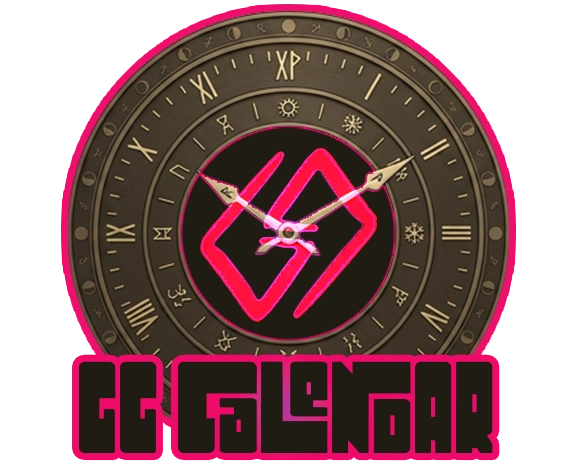

<div align="center">
  

  # GG Calendar

  **A modern calendar, weather & timekeeping module for Foundry VTT v12–v14**

  A lightweight, actively maintained alternative to Simple Calendar — built natively on ApplicationV2 with zero dependencies.

  
  
  
  
  

  **English** · [Español](#-español)
</div>

---

Track in-world date and time, **moon phases**, seasons and **dynamic weather**. Register GG Calendar as Foundry's native world calendar so other modules read your date. Paint **climate zones** on your maps. Auto-generate a **session chronicle** journal. Full **Simple Calendar API compatibility** for a seamless migration.

## ✨ Features

### Calendars & time
- **Built-in calendars**: Gregorian, Calendar of Harptos (Forgotten Realms), Greyhawk Common Year
- **Fully custom calendars** via a simple JSON definition — months, festivals, weekdays of any length, leap rules, seasons, epoch
- **Native world calendar** (Foundry v13+): GG Calendar registers as `game.time.calendar`, so other modules and systems read its date and format
- **Bidirectional time controls**: left-click advances, right-click rewinds (±1m, ±10m, ±30m, ±1h, ±8h, ±1d)
- **Exact date jumping** and automatic advancement on **D&D 5e rests** (short +1h, long +8h)

### Atmosphere
- **Moon phases** with lore-accurate moons — Selûne (Forgotten Realms), Luna & Celene (Greyhawk) — and full multi-moon support
- **Dynamic weather** generated from world climate and current season, posted to chat with coherent day-to-day temperature drift
- **Climate Zones** (Foundry v14): paint a Scene Region, assign it a climate, and weather + particle effects change as tokens move through it

### Campaign tools
- **Date notes** with GM-only visibility
- **Journal-backed notes**: turn any note into a rich ProseMirror journal page
- **Auto-Chronicle**: automatically logs combats, rests and scene changes with in-world timestamps, then compiles them into a session journal with one click

### Compatibility
- **Simple Calendar bridge**: exposes a Simple Calendar-style API so dependent modules keep working when Simple Calendar isn't installed
- **Live sync** across all connected clients
- **Public API and hooks** for macros and other modules
- Localized in **English and Spanish**

## 📦 Installation

In Foundry: **Add-on Modules → Install Module** and search for `GG Calendar`, or paste the manifest URL:

```
https://github.com/GegesVTT/gg-calendar/releases/latest/download/module.json
```

## 🚀 Quick start

1. Enable **GG Calendar** in **Manage Modules**.
2. Open the calendar from the scene controls (the calendar icon in the left toolbar).
3. Pick your calendar in **Game Settings → GG Calendar** (Gregorian, Harptos, Greyhawk or Custom).
4. Set your world climate and you're ready — advance time, add notes, and watch the weather roll in.

## 🔌 API

```js
const ggc = game.modules.get("gg-calendar").api;

ggc.open();                       // open the calendar
ggc.now();                        // current date object
ggc.advance(3600);                // advance 1 hour (negative rewinds)
ggc.setDate({ year: 1492, month: 0, day: 1, hour: 8 });
ggc.rollWeather();                // roll today's weather
ggc.moons();                      // current moon phases
ggc.chronicle.mark("The party struck a deal with the Zhentarim.");
ggc.chronicle.compile();          // build the session journal

Hooks.on("ggCalendar.dayChanged", date => { /* ... */ });
Hooks.on("ggCalendar.timeAdvanced", seconds => { /* ... */ });
```

## 🗓️ Custom calendar JSON

Select **Custom** in settings and edit the JSON. Example:

```json
{
  "name": "Calendar of the Twin Moons",
  "months": [
    { "name": "Firstlight", "days": 32 },
    { "name": "Moonfall Festival", "days": 1, "intercalary": true },
    { "name": "Deepfrost", "days": 32, "leapDays": 1 }
  ],
  "weekdays": ["Solday", "Luneday", "Forgeday", "Restday"],
  "leap": { "type": "simple", "interval": 5 },
  "epoch": { "year": 1000, "month": 0, "day": 1 },
  "epochWeekday": 0,
  "seasons": [{ "name": "Frostwane", "monthStart": 0, "icon": "fa-snowflake" }],
  "moons": [{ "name": "Pale Sister", "cycleDays": 27, "offset": 0 }],
  "yearSuffix": " AT"
}
```

- `intercalary: true` → festival days outside the weekday cycle, rendered as banners
- `leapDays` → extra days added to that month on leap years
- `leap.type` → `"none"`, `"simple"` (every `interval` years) or `"gregorian"`
- `moons` → each moon has a `cycleDays` length and an `offset` to align phase 0 (new moon)

## 🏷️ Keywords

calendar · weather · time · moons · moon phases · seasons · climate · Simple Calendar replacement · timekeeping · date · chronicle · D&D 5e rests · Forgotten Realms · Harptos · Greyhawk

## 📜 License

MIT — © Geges

<br>

---

<div align="center">

  ## 🇪🇸 Español

</div>

**Un módulo moderno de calendario, clima y gestión del tiempo para Foundry VTT v12–v14.** Una alternativa liviana y mantenida activamente a Simple Calendar, construida de forma nativa sobre ApplicationV2 y sin dependencias.

Lleva el control de la fecha y hora del mundo, las **fases lunares**, las estaciones y el **clima dinámico**. Registra GG Calendar como el calendario nativo del mundo para que otros módulos lean tu fecha. Pintá **zonas climáticas** en tus mapas. Generá automáticamente una **crónica de sesión** en el diario. Compatibilidad total con la **API de Simple Calendar** para una migración sin fricciones.

### ✨ Características

#### Calendarios y tiempo
- **Calendarios integrados**: Gregoriano, Calendario de Harptos (Reinos Olvidados), Greyhawk (Año Común)
- **Calendarios totalmente personalizables** mediante una definición JSON simple — meses, festivales, días de la semana de cualquier longitud, reglas de bisiestos, estaciones y época
- **Calendario nativo del mundo** (Foundry v13+): GG Calendar se registra como `game.time.calendar`, así otros módulos y sistemas leen su fecha y formato
- **Controles de tiempo bidireccionales**: click izquierdo avanza, click derecho retrocede (±1m, ±10m, ±30m, ±1h, ±8h, ±1d)
- **Salto a fecha exacta** y avance automático con los **descansos de D&D 5e** (corto +1h, largo +8h)

#### Atmósfera
- **Fases lunares** con lunas fieles al lore — Selûne (Reinos Olvidados), Luna y Celene (Greyhawk) — y soporte multi-luna completo
- **Clima dinámico** generado a partir del clima del mundo y la estación actual, publicado en el chat con una deriva de temperatura coherente día a día
- **Zonas climáticas** (Foundry v14): pintá una Región de Escena, asignale un clima, y el clima + los efectos de partículas cambian a medida que los tokens se mueven por ella

#### Herramientas de campaña
- **Notas por fecha** con visibilidad exclusiva para el GM
- **Notas vinculadas al diario**: convertí cualquier nota en una página rica de ProseMirror
- **Crónica automática**: registra combates, descansos y cambios de escena con marcas de tiempo del mundo, y los compila en un diario de sesión con un solo clic

#### Compatibilidad
- **Puente con Simple Calendar**: expone una API estilo Simple Calendar para que los módulos que dependen de él sigan funcionando cuando Simple Calendar no está instalado
- **Sincronización en vivo** en todos los clientes conectados
- **API pública y hooks** para macros y otros módulos
- Localizado en **inglés y español**

### 📦 Instalación

En Foundry: **Módulos Complementarios → Instalar Módulo** y buscá `GG Calendar`, o pegá la URL del manifiesto:

```
https://github.com/GegesVTT/gg-calendar/releases/latest/download/module.json
```

### 🚀 Inicio rápido

1. Activá **GG Calendar** en **Gestionar Módulos**.
2. Abrí el calendario desde los controles de escena (el ícono de calendario en la barra izquierda).
3. Elegí tu calendario en **Configuración del juego → GG Calendar** (Gregoriano, Harptos, Greyhawk o Personalizado).
4. Configurá el clima de tu mundo y listo — avanzá el tiempo, agregá notas y mirá llegar el clima.

### 🔌 API

```js
const ggc = game.modules.get("gg-calendar").api;

ggc.open();                       // abre el calendario
ggc.now();                        // objeto de fecha actual
ggc.advance(3600);                // avanza 1 hora (negativo retrocede)
ggc.setDate({ year: 1492, month: 0, day: 1, hour: 8 });
ggc.rollWeather();                // genera el clima de hoy
ggc.moons();                      // fases lunares actuales
ggc.chronicle.mark("El grupo cerró un trato con los Zhentarim.");
ggc.chronicle.compile();          // genera el diario de sesión

Hooks.on("ggCalendar.dayChanged", date => { /* ... */ });
Hooks.on("ggCalendar.timeAdvanced", seconds => { /* ... */ });
```

### 🗓️ JSON de calendario personalizado

Seleccioná **Personalizado** en la configuración y editá el JSON. Ejemplo:

```json
{
  "name": "Calendario de las Lunas Gemelas",
  "months": [
    { "name": "Primaluz", "days": 32 },
    { "name": "Festival de la Caída Lunar", "days": 1, "intercalary": true },
    { "name": "Hondoescarcha", "days": 32, "leapDays": 1 }
  ],
  "weekdays": ["Soldía", "Lunadía", "Forjadía", "Descansodía"],
  "leap": { "type": "simple", "interval": 5 },
  "epoch": { "year": 1000, "month": 0, "day": 1 },
  "epochWeekday": 0,
  "seasons": [{ "name": "Ocaso Helado", "monthStart": 0, "icon": "fa-snowflake" }],
  "moons": [{ "name": "Hermana Pálida", "cycleDays": 27, "offset": 0 }],
  "yearSuffix": " EG"
}
```

- `intercalary: true` → días festivos fuera del ciclo de la semana, mostrados como banners
- `leapDays` → días extra agregados a ese mes en años bisiestos
- `leap.type` → `"none"`, `"simple"` (cada `interval` años) o `"gregorian"`
- `moons` → cada luna tiene una longitud `cycleDays` y un `offset` para alinear la fase 0 (luna nueva)

### 🏷️ Palabras clave

calendario · clima · tiempo · lunas · fases lunares · estaciones · alternativa a Simple Calendar · gestión del tiempo · fecha · crónica · descansos de D&D 5e · Reinos Olvidados · Harptos · Greyhawk

### 📜 Licencia

MIT — © Geges
